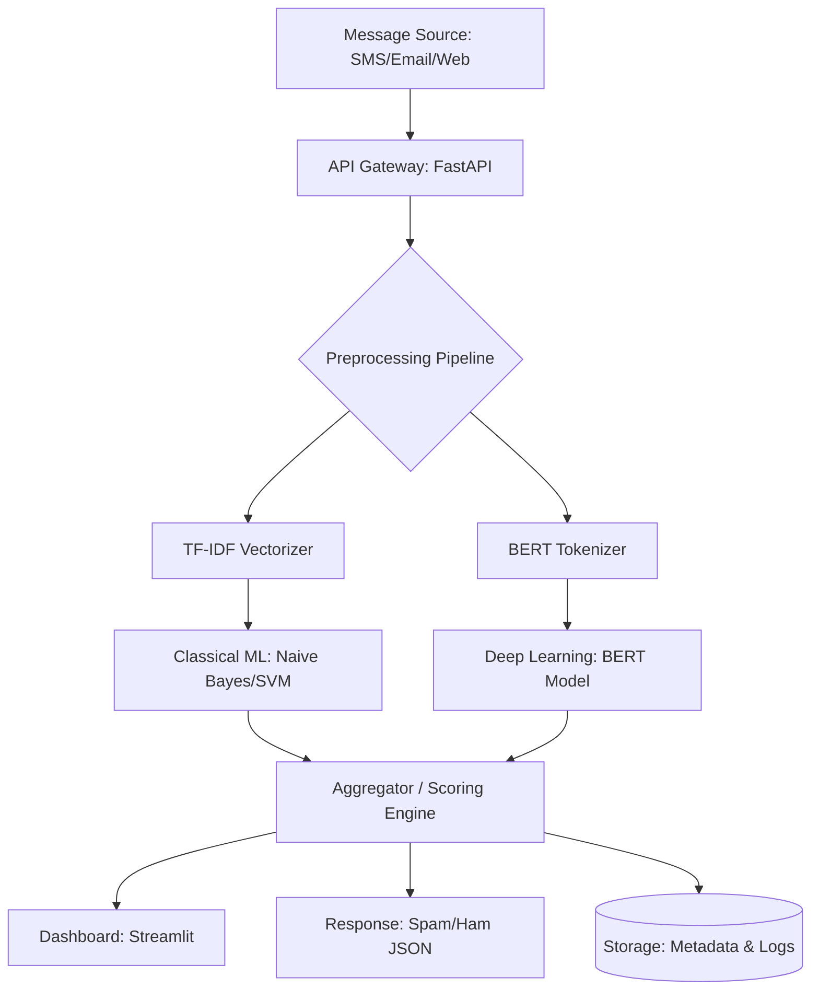

# Functional Requirements Document (FRD)
## Spam / Fraud Message Detection System

---

### 1. Introduction

This document provides technical specifications for the Spam/Fraud Detection System, detailing the components, data flows, and technical requirements.

---

### 2. System Architecture



#### 2.1 Technology Stack
- **Backend:** FastAPI (Python 3.9)
- **NLP:** Scikit-learn, Transformers (Hugging Face)
- **Frontend/Dashboard:** Streamlit
- **Model Storage:** Pickle (for TF-IDF/ML), PyTorch Save (for BERT)
- **Containerization:** Docker

---

### 3. Functional Specifications

#### 3.1 Preprocessing Module (`src/preprocessing/`)
- **Text Cleaning:** Remove HTML tags, URLs (extract for analysis), extract phone numbers.
- **Normalization:** Lowercasing, removing extra whitespace.
- **Spam Specifics:** Identifying repetitive characters (e.g., "FREE!!!!"), excessive capitalization.

#### 3.2 Feature Extraction Module (`src/features/`)
- **TF-IDF:** Generate sparse matrices for fast classification.
- **BERT Embeddings:** 768-dimension vectors for deep semantic analysis of phishing intent.

#### 3.3 Model Module (`src/models/`)
- **Classical Model:** `SpamClassifierNB` (Multinomial Naive Bayes).
- **Advanced Model:** `SpamBERT` (Fine-tuned `bert-base-uncased`).
- **Performance Expectation:**
    - NB: High speed, 85% accuracy.
    - BERT: Real-time, 95%+ accuracy, catches nuanced sarcasm and context.

#### 3.4 API Endpoints (`src/api/`)
- `POST /v1/detect`: Takes a single message string, returns prediction and confidence.
- `POST /v1/batch-detect`: Takes a list of messages or file upload.
- `GET /v1/health`: Returns model version and system status.

#### 3.5 Dashboard Specifications (`dashboard/`)
- **Metrics:** Total messages processed, Spam vs Ham ratio.
- **Word Cloud:** Most frequent spam keywords (e.g., "Win", "Offer", "Link").
- **Alert Map:** (Optional) Geographic hotspot of spam sources.

---

### 4. Data Specifications

#### 4.1 Input Schema
```json
{
  "message_text": "Congratulations! You won a $1000 gift card. Click here: bit.ly/spam",
  "metadata": {
    "source": "SMS",
    "sender_id": "+123456789"
  }
}
```

#### 4.2 Output Schema
```json
{
  "prediction": "Spam",
  "confidence": 0.98,
  "risk_level": "High",
  "features_detected": ["link_present", "urgency_detected"],
  "model": "BERT-v1"
}
```

---

### 5. Security & Performance

- **Rate Limiting:** Protect API from being DDOSed by automated spam bots.
- **Model Quantization:** Use ONNX or DistilBERT to reduce latency if CPU performance is a bottleneck.
- **PII Scrubbing:** Ensure message content is scrubbed before logging for analytics.

---

### 6. Deployment Plan

- **Environment:** AWS EC2 G4dn (for GPU) or CPU-optimized instance for DistilBERT.
- **CI/CD:** Automated testing for prediction drift.
- **Monitoring:** Log prediction confidence distribution to detect when the model needs retraining.
